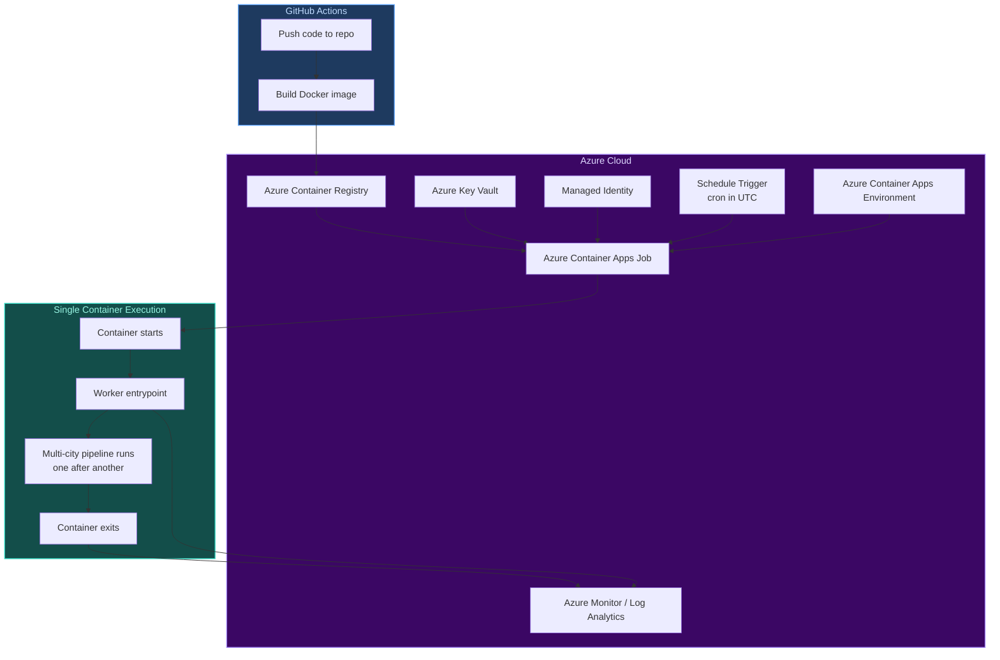
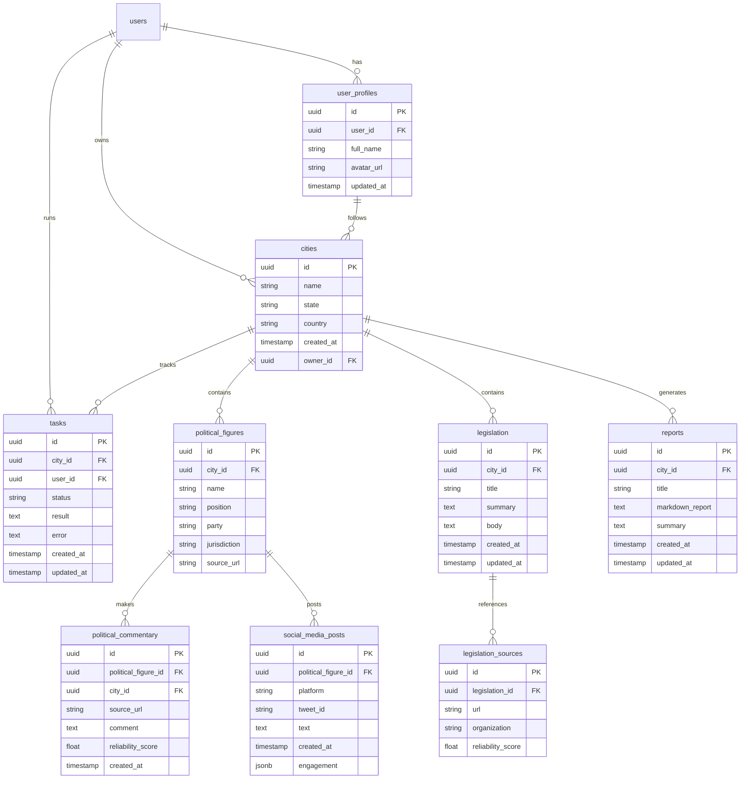
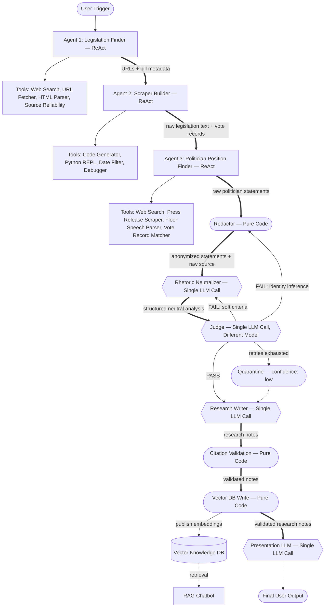

# Software Infrastructure Diagrams

This document contains key infrastructure diagrams for the Next Voters project.

## Azure Infrastructure CI/CD Pipeline

This diagram illustrates the continuous integration and deployment pipeline using GitHub Actions and Azure Container Apps. It shows the flow from code push to container execution with monitoring.

## Supabase Database Schema

Entity-relationship diagram showing the database schema for the Next Voters application. It includes tables for users, cities, political figures, legislation, tasks, and their relationships.

## System Design: Legislation & Accountability Pipeline

This diagram depicts the sequential pipeline for legislation analysis and accountability, using LangGraph with three ReAct agents, single LLM calls, and pure code steps. It includes conditional retry logic and vector database integration.

